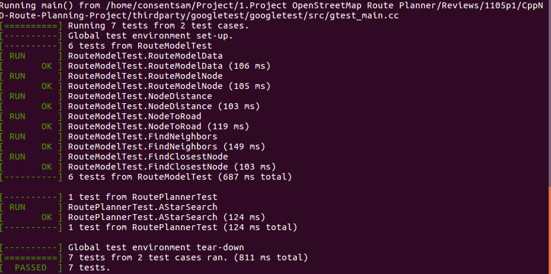

# OpenStreetMap Route Planner

#### Build
The project code must compile without errors using `cmake` and `make`.


#### Testing

For exercises that have unit tests, the project must be built with the approprate test cpp file. This can be done by using `cmake_tests` instead of `cmake`. For example, from the build directory:
```
cmake_tests ..
make
```
Those commands will build the code with the appropriate tests exercise. The tests can then be run from the `build` directory as follows:
```
../bin/test
```
Not all exercises have tests. The table is given below with the complete list of exercises with tests for reference:

| Exercise Name               | 
|-----------------------------|
| The RouteModel Class        |
| The Node Class              |
| Create RouteModel Nodes     |
| Write the Distance Function |
| Create Road to Node Hashmap |
| Write FindNeighbors         |
| Find the Closest Node       |
| Write the A* Search Stub    |
| Finish A* Search            |




#### Executing

A user running the project should be able to input values between 0 and 100 for the start x, start y, end x, and end y coordinates of the search, and the project should find a path between the points.


Since our map is restricted between 0 to 100 in every aspect i.e. in x and y coordinates.
So we can put an invalid entry checker, that will make sure that the user doesn't put any arbitrary
value out of the range 0 to 100.
Following code can make sure of that
Please find the code in main.cpp

The coordinate (0, 0) should roughly correspond with the lower left corner of the map, and (100, 100) with the upper right.

Note that for some inputs, the nodes might be slightly off the edges of the map, and this is fine.


